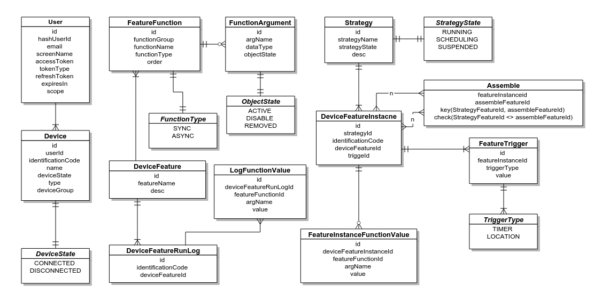

## 概述
**Sunny**是Anicloud平台开发的示例第三方应用（服务）。第三方应用（服务）通过**ServiceBus**接入Anicloud平台，实现对对象Stub的操作。在**Sunny**中要实现对平台提供的**Service-Agent** SDK的调用，并在基础Stub上抽象了**Feature**与**Strategy**两类跟实际应用相关的对象。**Sunny**主要包括Stub-to-Feature的抽象定义；Feature-to-Strategy的基于触发的抽象定义；应用-用户状态维护；用户信息初始化；基于**Service-Agent**的Stub方法调用；基于**ClientInvokable**接口的平台对第三方应用的调用。**Sunny**还应实现基于平台的消息订阅，实现对用户设备信息的动态更新。

## 名词解释
* __Stub__ 
 
 >Anicloud平台定义的对象功能的抽象描述类。可以由设备提供或者第三方应用（服务）提供。都需要提前在Acniloud平台进行注册，并关联到对应的对象上。

* __Feature__ 
 
 >Sunny应用对底层Stub的进一步抽象，代表一个完整的功能。开发者需要在Sunny中的配置文件进行配置。将用户的Stub列表映射成Feature，形成用户的Feature列表。

* __Strategy__ 

 >Feature的基于触发器（Trigger）的集合。多个Feature在某些条件下被触发执行的一个序列。Strategy重新定义了Stub的上层抽象使用场景，提供了各种可能性。

* __Trigger__ 
 
 >Feature的触发条件，即在满足某种Trigger的条件下，Feature会自动执行。
 
## 功能列表
### 应用信息注册
Sunny在能够授信前，首选需要在Anicloud平台注册其相关信息。平台将为其颁发唯一的ID和secret码，作为其之后接入平台的凭证。

### Feature的定义
Feature是由第三方应用（服务）的开发者在开发第三方应用时针对所需要调用的Stub设计好的。应用开发者针对需要调用的Stub进行进一步的抽象，在此基础上生成Sunny可以支持的Feature列表。当用户授信玩第三方应用后，对用户进行初始化时，需要根据Feature列表识别能够处理的用户设备。

### Strategy的管理
Strategy是在Feature的基础上，与各种Trigger混合生成的任务。系统在当前的设计中，有基于时间点的Trigger和基于Location的Trigger。Trigger同时是可以扩展的。Strategy是为具体的可定制的业务场景而定制的。

### 基于OAuth2.0的授信
Sunny的用户都是由在Anicloud平台注册的用户授信后得到的。Sunny系统需要通过**Service-Agent**提供的OAuth服务来实现授信的流程。目前对Sunny来说，是采用**Authorization Code**模式实现授信。

### 用户信息初始化
Sunny系统在用户授信后，将对用户的设备信息初始化。Sunny会先定义需要处理的Stub-to-Feature的映射关系，系统会根据这个关系生成用户-设备-Feature的关联管理。

### Strategy调度系统
Strategy调度系统是为Job的运行提供支撑的。Sunny将基于时间点触发的Trigger组成的Strategy提交给调度系统，由调度系统管理其运行。

### Sunny系统注册的Stub回调
Sunny作为第三方应用可以设计自己的Stub，然后在Anicloud平台注册。当用户授信给Sunny后，Sunny需要绑定其所有的Stub给对应的用户对象。这样平台就可以通过**Service-Agent**反向调用用户对象的Stub，实现平台对应用的调用。

### 用户对象（AccountObject）的状态维护
当用户授信给Sunny，并在Sunny上登录后，Anicloud平台需要维护Bus-App-Account对象的状态。Sunny需要通过**Service-Agent**提供的接口向平台汇报用户的状态。并给用户对象绑定需要为其关联的Stub列表。

## 设计实现
### 技术选择
* Spring Framework
* JMS
* AngularJS
* Hibernate JPA
* Quartz

### 系统设计

### E-R图

### 核心对外接口

### 核心业务类

### 外部接口

### Service-Agent调用

## 部署要求

## 引用参考
